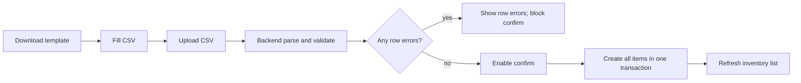

# HomeVault Phase 4C-4 Inventory Import Design

## Purpose

Phase 4C-4 adds a safe CSV import workflow for inventory items. Phase 4C-3 already added filtered CSV export and selected-item batch operations. This slice completes the matching inbound workflow: download a template, upload a CSV, preview row-level validation results, and confirm import only when the file is clean.

The first import slice is create-only. It does not update existing items, merge duplicates, import images, or import attachments.

## Scope

Included:

- CSV template download for inventory item imports.
- CSV upload and server-side validation preview.
- Row-level validation errors and normalized preview rows.
- Confirmed create-only import after a successful preview.
- Frontend import dialog reachable from the inventory toolbar.
- Permission boundary: import requires `items:create`.
- Privacy support through the existing `privacy_level` field.

Excluded:

- Updating existing items by id, name, barcode, or external key.
- Importing images or attachments.
- Partial commit of valid rows when other rows fail.
- Background jobs for very large files.
- Importing reminders, loans, movement history, or quantity history beyond normal item creation.
- Custom duplicate merge rules.

## User Workflow

The inventory toolbar adds an import entry for users with `items:create`.

1. User downloads the CSV template.
2. User fills rows offline.
3. User uploads the CSV in the import dialog.
4. Backend validates every row and returns a preview.
5. If any row has errors, the confirm button stays disabled and the UI shows row-level messages.
6. If all rows are valid, user confirms import.
7. Backend creates all rows in one transaction and returns imported item ids/count.
8. Frontend refreshes the item list and closes the dialog.

## CSV Format

Template columns:

- `name` required.
- `description` optional.
- `category` required; matches active category name or code.
- `status` required; matches active status name or code.
- `quantity` optional, defaults to `1`.
- `unit` optional, defaults to the item API default.
- `owner` optional; matches active family member name.
- `keeper` optional; matches active family member name.
- `residence` optional when a container is used; required when resolving a location name that is not globally unique.
- `location` optional; matches active location node name or slash path.
- `container` optional; matches active container item name.
- `is_container` optional boolean.
- `privacy_level` optional, one of `normal` or `sensitive`, defaults to `normal`.
- `tags` optional comma-separated list.

Custom fields use dynamic columns named `field:<attribute_key>`. Only active fields for the chosen category are editable. Required active custom fields must be present. Existing category-field validation rules apply.

Placement rules match normal item creation:

- `location` and `container` are mutually exclusive.
- Non-exit statuses require a location or container.
- Exit-style statuses may omit placement.
- Container target must be an active, non-archived container item.

## Backend API

All routes live under `/api/items/import`.

- `GET /api/items/import/template.csv`
  - Requires `items:create`.
  - Returns a CSV template with static columns and dynamic `field:<key>` columns for active attribute definitions.

- `POST /api/items/import/preview`
  - Requires `items:create`.
  - Accepts one CSV file.
  - Parses and validates all rows.
  - Returns an import session token, normalized preview rows, row errors, valid count, invalid count, and total count.
  - Does not write inventory data.

- `POST /api/items/import/confirm`
  - Requires `items:create`.
  - Accepts the preview token returned by the preview endpoint.
  - Re-validates the cached parsed payload before writing.
  - Creates all rows in one transaction.
  - Returns imported count and item ids.

The preview token uses a process-local in-memory cache keyed by a random URL-safe token. Entries expire after 30 minutes. This is acceptable for this local-first project slice because imports are short-lived and confirmation happens immediately after preview. The cache stores normalized create payloads, not raw uploaded file bytes.

## Validation And Errors

Validation returns structured row results:

- Row number from the CSV file, including header offset.
- Original display values.
- Normalized create payload when valid.
- Error list with field names and Chinese messages.

Validation rules:

- Missing required fields fail the row.
- Unknown category/status/member/location/container values fail the row.
- Ambiguous member/location/container names fail the row and ask the user to disambiguate using a slash path or unique name.
- Duplicate names are warnings, not hard failures, in this slice.
- Any invalid row blocks confirm import.
- Empty files and files over the row limit fail the preview request.

The row limit is 500 rows for the first slice. This keeps validation and transaction behavior predictable without adding background jobs.

## Duplicate Strategy

Phase 4C-4 does not update or merge existing items.

If a row name matches an existing active item in the same category, the preview returns a warning. The user may still import it because household inventory can legitimately contain duplicate names. Future phases can add update-by-id or external-key import modes.

## Frontend Design

`ItemsPage.vue` keeps the import action near the existing export action. The toolbar emits `import-items` when the user can create items.

Create `ItemImportDialog.vue`:

- Download template button.
- File upload control for `.csv`.
- Preview result summary.
- Error table for invalid rows.
- Preview table for valid rows.
- Confirm button enabled only when total rows are greater than zero and invalid count is zero.

The dialog should not duplicate item form logic. It calls typed API helpers through the inventory store, displays server validation output, and reloads inventory after confirm.

## Data Flow

## Testing

Backend tests:

- Template endpoint returns static and active custom-field columns.
- Preview accepts a valid CSV and returns normalized rows without creating items.
- Preview reports row-level errors for missing name, unknown category, invalid status, invalid quantity, and bad placement.
- Confirm creates all previewed rows and writes normal quantity history through the existing create path.
- Confirm rejects invalid or expired preview tokens.
- Viewer/editor permission boundaries match create permission.

Frontend tests:

- API/store contract checks for template, preview, and confirm helpers.
- UI contract checks toolbar import entry, import dialog wiring, preview/error table, and confirm disabled state.

Regression verification:

- Existing inventory tests remain green.
- Existing frontend contract and build checks remain green.

## Completion Criteria

Phase 4C-4 is complete when a user with `items:create` can download a template, upload a valid CSV, preview normalized rows, confirm import, and see the created items in the inventory list. Invalid CSV files must show actionable row errors and must not create any items.
